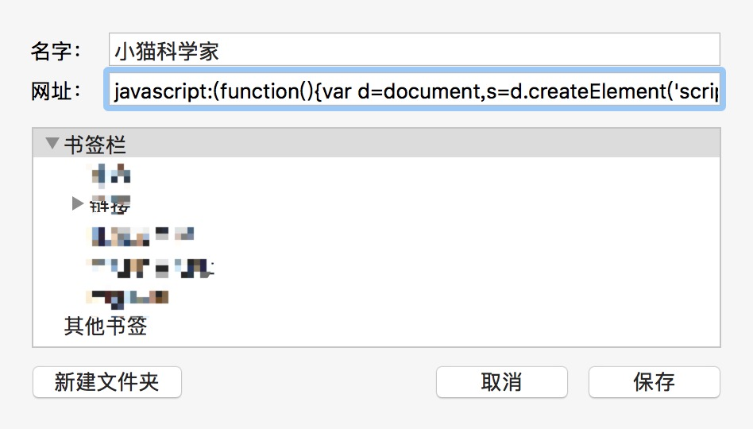

# 小猫科学家

Kitten Scientists (KS) is a simple automation script for the complex [Kittens Game](http://bloodrizer.ru/games/kittens/).

## 基本用法

复制下面的JavaScript代码，创建一个新书签，并将代码粘贴在地址栏里面，如图：

* 中文版：
    javascript:(function(){var d=document,s=d.createElement('script');s.src='https://zhaolinxu.github.io/kitten-scientists-zhs/kitten-scientists.user.js';d.body.appendChild(s);})();

* 英文版：
    javascript:(function(){var d=document,s=d.createElement('script');s.src='https://rawgit.com/cameroncondry/cbc-kitten-scientists/master/kitten-scientists.user.js';d.body.appendChild(s);})();

### Alternative Installation

You can also permanently install Kitten Scientists with a userscript manager.

- On **Firefox**, you'd want to use [Greasemonkey](https://addons.mozilla.org/en-US/firefox/addon/greasemonkey/).
- On **Chrome** and **Opera**, you'd want to use [Tampermonkey](https://chrome.google.com/webstore/detail/tampermonkey/dhdgffkkebhmkfjojejmpbldmpobfkfo).

Now simply [open the script](https://raw.githubusercontent.com/cameroncondry/cbc-kitten-scientists/master/kitten-scientists.user.js) and you should be prompted to install it. 

## Functionality

- Several UI adjustments (depending on selected theme).
- Automates:
    - Building
    - Crafting
    - Hunting
    - Praising
    - Holding festivals

### Building

By default, buildings are built if their required resources are at 75% of their storage capacity. For space structures,
the default threshold is 95%.

### Crafting

Craftable resources are crafted when the resources required for the craft are at 95% of their storage capacity.
 
Additionally, you can set a *consumption rate* (60% by default). This defines how much of the available resources can be
used for crafting.

### Trading

Trades happen when the traded resource is at 95% of the storage capacity. The trades are optimized to only happen during
seasons when the trade is most effective.

### Hunting

Hunts when catpower is at 95% capacity and builds luxury items before the hunt is sent.

### Praising

Praises when faith is at 99% capacity.

### Game Log

Automatically observes astronomical events.

## Contributors

If you would like to contribute to the Kitten Scientists, then you can do so in these ways:

- Submit issues or bugs you find, or functionality that would improve the project.
- Fork the repository, add some functionality, then submit a pull request.

Thanks to these past and present contributors!

- [adituv](https://github.com/adituv)
- [Azulan](https://www.reddit.com/user/Azulan)
- [carver](https://github.com/carver)
- [coderpatsy](https://github.com/coderpatsy)
- [DirCattus](https://www.reddit.com/user/DirCattus)
- [DrGaellon](https://github.com/DrGaellon)
- [enki1337](https://github.com/enki1337)
- [FancyRabbitt](https://www.reddit.com/user/FancyRabbitt)
- [gnidan](https://github.com/gnidan)
- [jacob-keller](https://github.com/jacob-keller)
- [jcranmer](https://github.com/jcranmer)
- [magus424](https://github.com/magus424)
- [mammothb](https://github.com/mammothb)
- [Mewnine](https://www.reddit.com/user/Mewnine)
- [mjdillon](https://github.com/mjdillon)
- [mmccubbing](https://github.com/mmccubbing)
- [oliversalzburg](https://github.com/oliversalzburg)
- [pefoley2](https://www.reddit.com/user/pefoley2)
- [sapid](https://github.com/sapid)
- [sjdrodge](https://github.com/sjdrodge)
- [SphtMarathon](https://www.reddit.com/user/SphtMarathon)
- [trini](https://github.com/trini)
